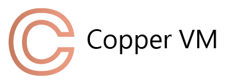

<p align="center">
    
</p>

<p align="center">
    A simple <b>Virtual Machine</b> with his own byte-code.
</p>

## Executables

The Copper VM ecosystem is composed by this executables:

* **casm** Assembler for the VM custom byte-code 
* **deasm** Disassembler for the VM byte-code
* **emulator** VM emulator that runs any binary program
* **copperdb** Debugger for the VM program

## Quick Start

### Pre-compiled binaries

Official pre-compiled binaries are available for download [here](https://github.com/Supercaly/coppervm/releases/tag/v0.0.1)

### Install from source

You can compile the programs form source, first you need to this repository locally with 

```console
$ git clone https://github.com/Supercaly/coppervm.git
```

and then build the executables in a local `build` directory using:

```console
$ ./scripts/build_programs.sh
```

or you can install them to your go's `GOPATH` directory using:

```console
$ ./scripts/install_programs.sh
```

**Note:** On *Windows* run the scripts with same name but extension *.bat*
