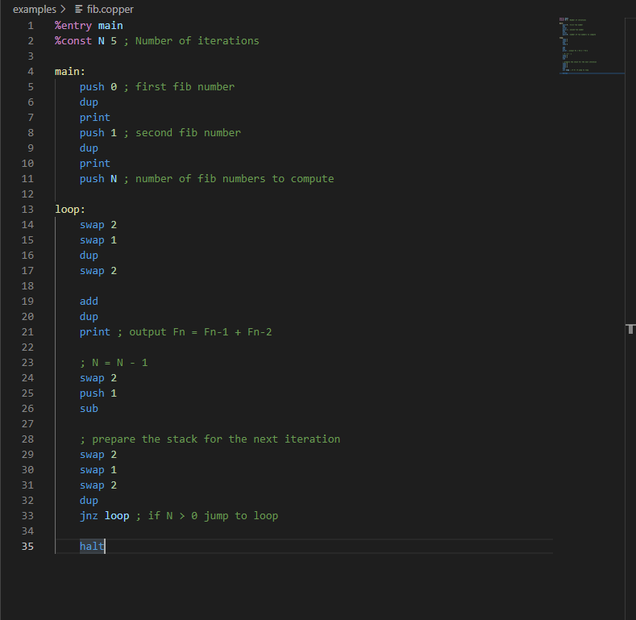

# CopperVM VSCode extension

The **CopperVM** VS Code extension provides language support for the [CopperVM](https://github.com/Supercaly/coppervm) ecosystem.

## Quick Start

Before using this extension make sure to follow this steps:

1. If you haven't done so already, install [CopperVM](https://github.com/Supercaly/coppervm)
2. To install this extension outside of the Marketplace simply copy the extension's directory into the `<user home>/.vscode/extensions` folder and restart Code

## Features

This extension provides Syntax Highlighting for the `copper` assembly language.

**Enjoy!**
